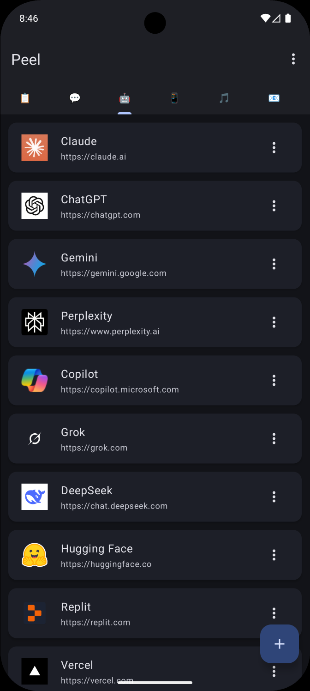
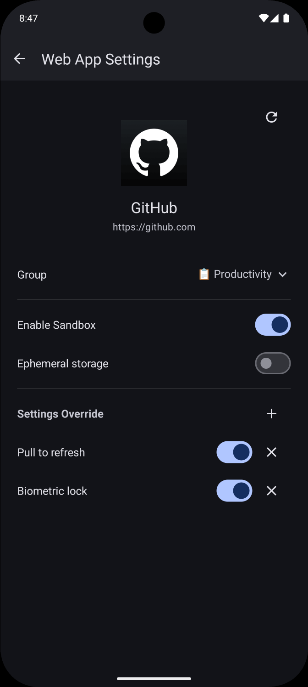
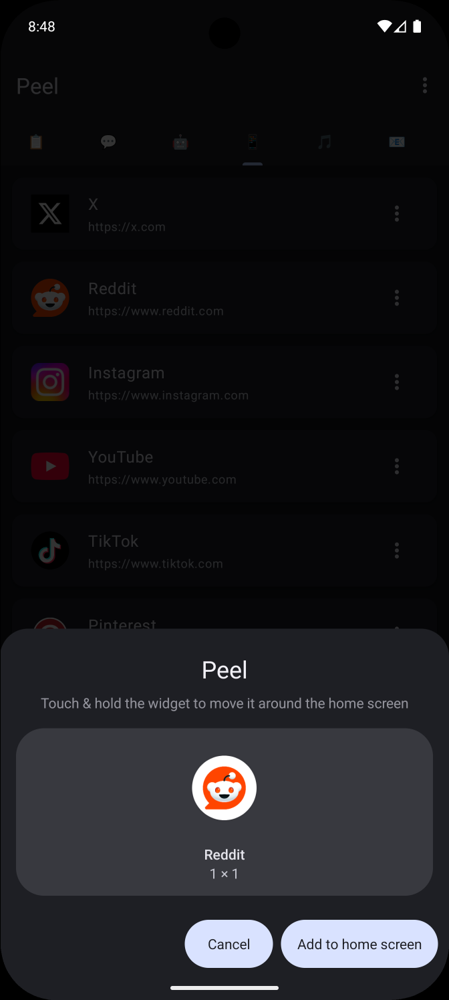
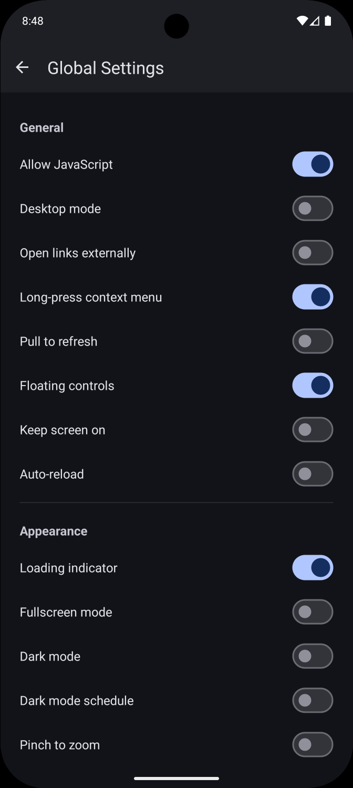

  

# Peel

⚠️ **Alpha:** This project is in early development. Expect breaking changes and instability

**Turn any website into a native-like Android app**

Peel is an open-source Android app that turns websites into standalone, app-like experiences. It lets you create lightweight web apps with custom icons, isolated storage, and fine-grained privacy controls, separate from browsers.

Uses System Android WebView for efficient rendering and minimal resource usage.

## Features

- Add websites as standalone apps with automatic icon and title fetching
- Launch web apps directly from your home screen with adaptive icons
- App grouping
- Per-group and per-app optional isolated sandbox processes with separate cookies and storage
- Block third-party requests, manage cookies, enforce HTTPS, set custom headers, etc
- Lock sensitive web apps behind fingerprint or face authentication, set flag secure to disallow screencasting and screenshots
- Force dark theme on any website with optional scheduling
- Set settings globally or override them per app
- Export and import all web apps and settings with all properties and icons
- Written in Kotlin with Modern Material 3 interface

## Screenshots

|  |  |  |  |
|:--:|:--:|:--:|:--:|

## Acknowledgments

Hard fork of [Native Alpha](https://github.com/cylonid/NativeAlphaForAndroid) with significant changes including flow refactoring, removal of redundant options, and new features. Not compatible with the original.

Changes from Native Alpha

#### Removed Features
- Ad blocking
- Multi-touch gestures (2-finger navigation, 3-finger app switching, 2-finger reload)
- Custom WebView context menu pop-up

#### Added Features
- Material Design 3 dynamic color support
- More reliable UUID-based app storage
- Web-app reordering
- App grouping and per-group sandboxing
- Backups now include webapp positions in the list and images
- Persistent notification with Home/Share/Reload actions
- Optional pull-to-refresh
- More reliable icon fetching
- Letter icon generator
- Per-webapp setting overrides via a picker dialog
- Custom HTTP header map (replaces the dedicated user-agent setting)
- Always-use-HTTPS upgrade setting
- Disable screenshots setting (`FLAG_SECURE`)
- Long-press link sharing
- Per-webapp sandbox data clearing

## License

[GPL-3.0](LICENSE)
