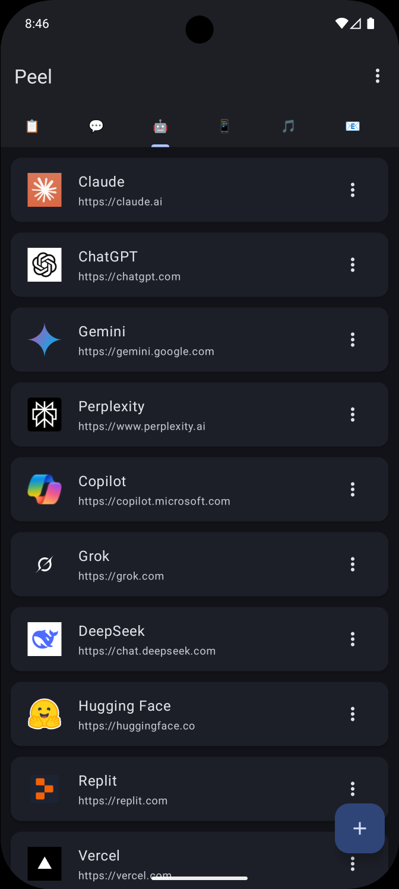
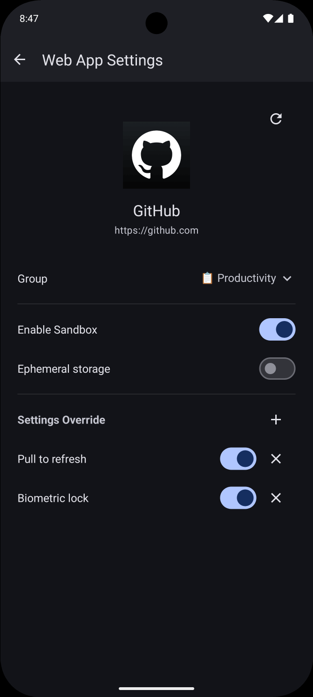
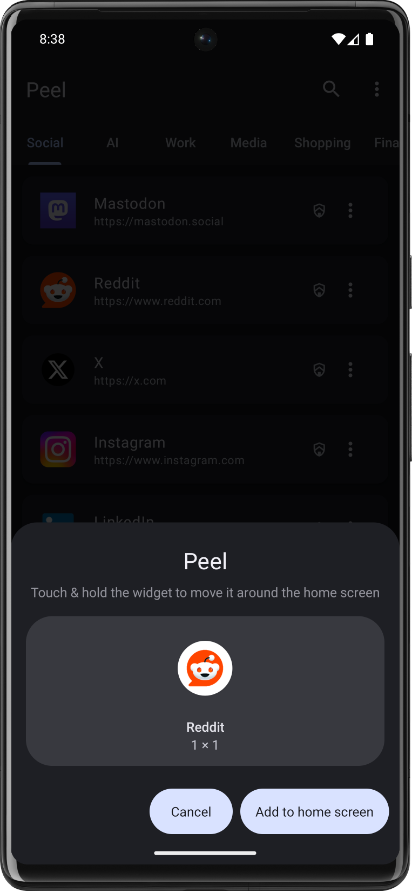
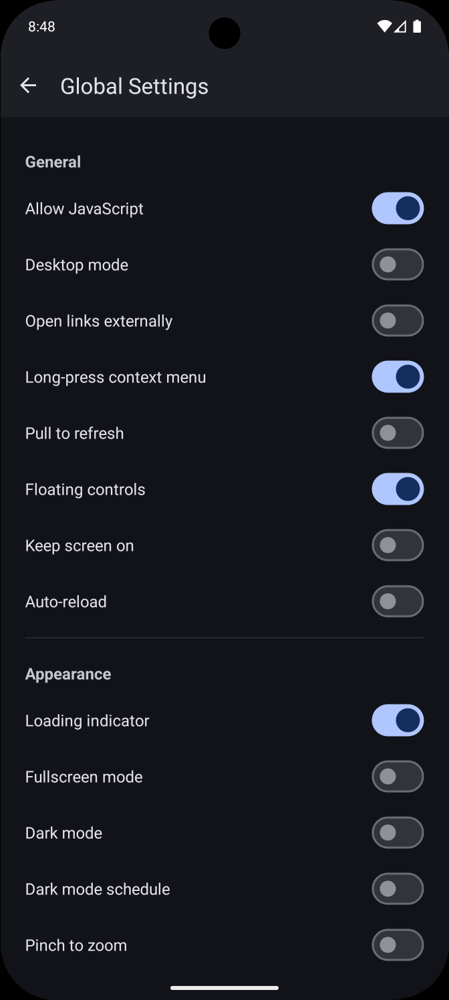

  

# Peel

**Turn any website into a native-like Android app**

Peel is an open-source Android app that turns websites into standalone, app-like experiences. It lets you create lightweight web apps with custom icons, isolated storage, and fine-grained privacy controls, separate from your browser.

Powered by GeckoView (Mozilla's browser engine) for strong privacy, extension support, and modern web compatibility.

## Features

- Add websites as standalone apps with automatic icon and title fetching
- Launch web apps directly from your home screen with adaptive icons
- App grouping with home screen group shortcuts
- Per-group and per-app optional isolated sandbox with separate cookies and storage
- Smart external link routing to other Peel apps or system browser
- Privacy controls: GPC signal, fingerprinting protection, local network blocking, WebRTC IP leak prevention
- Enhanced Tracking Protection, HTTPS-only mode, custom headers
- Lock sensitive web apps behind biometric authentication, block screenshots
- Dynamic status bar color matching web content
- Background media playback with full MediaSession support (notification controls, seek, metadata)
- Pull-to-refresh with proper APZ integration
- Set settings globally or override them per app
- Export and import all web apps and settings with all properties and icons
- Written in Kotlin with Material 3 interface

## Screenshots

|  |  |  |  |
|:--:|:--:|:--:|:--:|

## Acknowledgments

Hard fork of [Native Alpha](https://github.com/cylonid/NativeAlphaForAndroid) with significant changes including a full migration from WebView to GeckoView, flow refactoring, removal of redundant options, and new features. Not compatible with the original.

Changes from Native Alpha

#### Removed Features
- Ad blocking
- Multi-touch gestures (2-finger navigation, 3-finger app switching, 2-finger reload)

#### Added Features
- GeckoView engine (replacing Android WebView)
- Privacy: GPC signal, fingerprinting protection, local network blocking, WebRTC IP leak prevention
- Dynamic status bar color from web content via browser extension
- Smart external link routing between Peel apps
- Material Design 3 dynamic color support
- More reliable UUID-based app storage
- Web-app reordering
- App grouping and per-group sandboxing
- Backups now include webapp positions in the list and images
- Floating controls with Home/Share/Reload actions
- Pull-to-refresh with Gecko APZ integration
- More reliable icon fetching via headless browser
- Letter icon generator
- Per-webapp setting overrides via a picker dialog
- Custom HTTP header map
- HTTPS-only upgrade setting
- Biometric lock and screenshot blocking (`FLAG_SECURE`)
- Long-press context menu with link sharing
- Per-webapp sandbox data clearing
- Auth redirect chain handling for clean back navigation

## License

[GPL-3.0](LICENSE)
