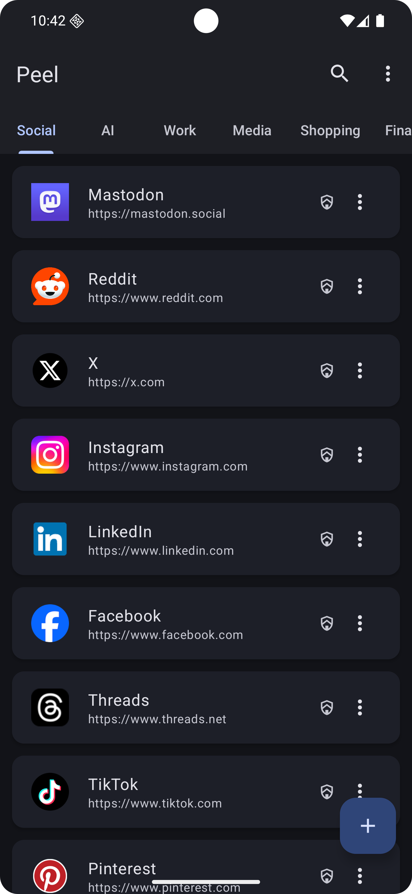
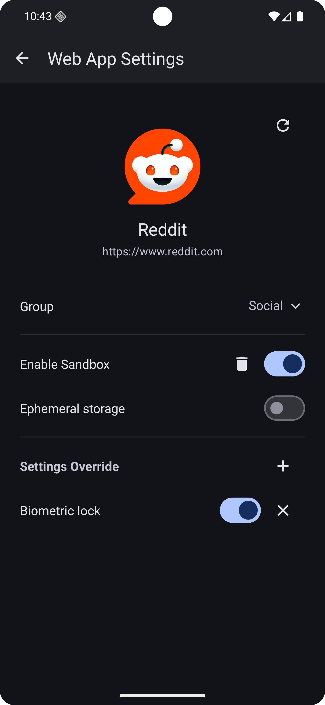
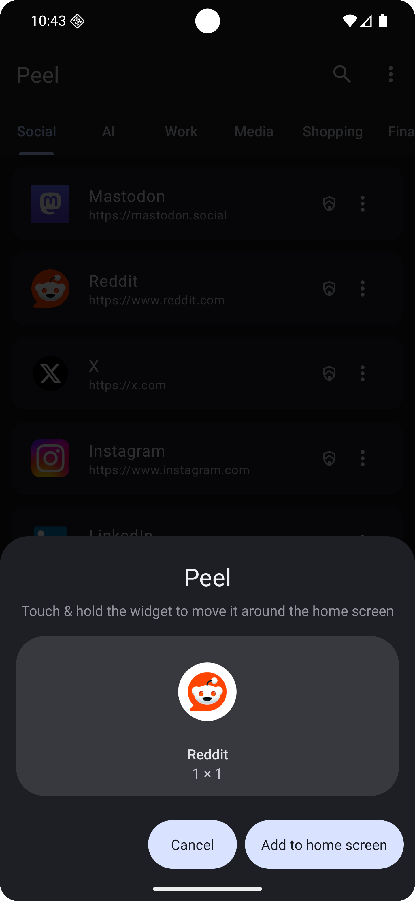
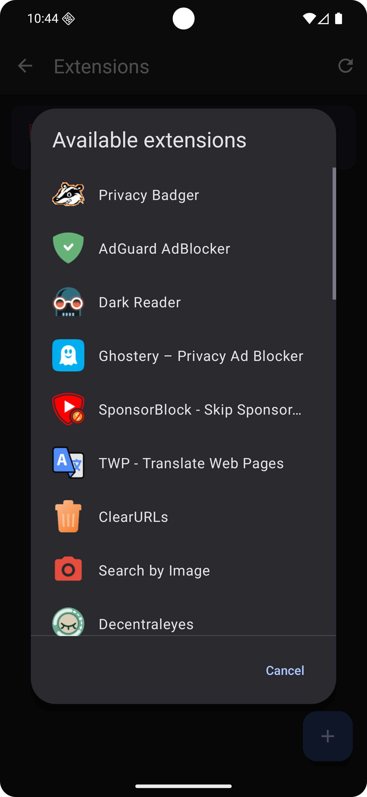

  

# Peel

**Turn any website into a native-like Android app**

Peel is an open-source Android app that turns websites into standalone, app-like experiences. It
lets you create lightweight web apps with custom icons, isolated storage, and fine-grained privacy
controls, separate from your browser.

Powered by GeckoView (Mozilla's browser engine)

## Features

- Add websites as standalone apps with automatic icon and title fetching
- Launch web apps directly from your home screen with adaptive icons
- App grouping with home screen group shortcuts
- Per-group and per-app optional isolated sandbox with separate cookies and storage
- Per-sandbox HTTP, HTTPS, SOCKS4, and SOCKS5 proxy support
- Offline on-device page translations powered by Mozilla's translation models
- Smart external link routing to other Peel apps or system browser
- Privacy controls: GPC signal, fingerprinting protection, local network blocking, WebRTC IP leak
  prevention
- Firefox extensions support
- Enhanced Tracking Protection, HTTPS-only mode, custom headers
- Lock sensitive web apps behind biometric authentication, block screenshots
- Dynamic status bar color matching web content
- Background media playback with full MediaSession support (notification controls, seek, metadata)
- Set settings globally or override them per app
- Share individual apps and groups, or export and import full backups
- Written in Kotlin with Material 3 interface

## Screenshots

|  |  |  |  |
| :----------------------------------------: | :----------------------------------------: | :----------------------------------------: | :----------------------------------------: |

## Acknowledgments

Hard fork of [Native Alpha](https://github.com/cylonid/NativeAlphaForAndroid) with significant
changes including a full migration from WebView to GeckoView, flow refactoring, removal of redundant
options, and new features. Not compatible with the original.

## License

[GPL-3.0](LICENSE)
